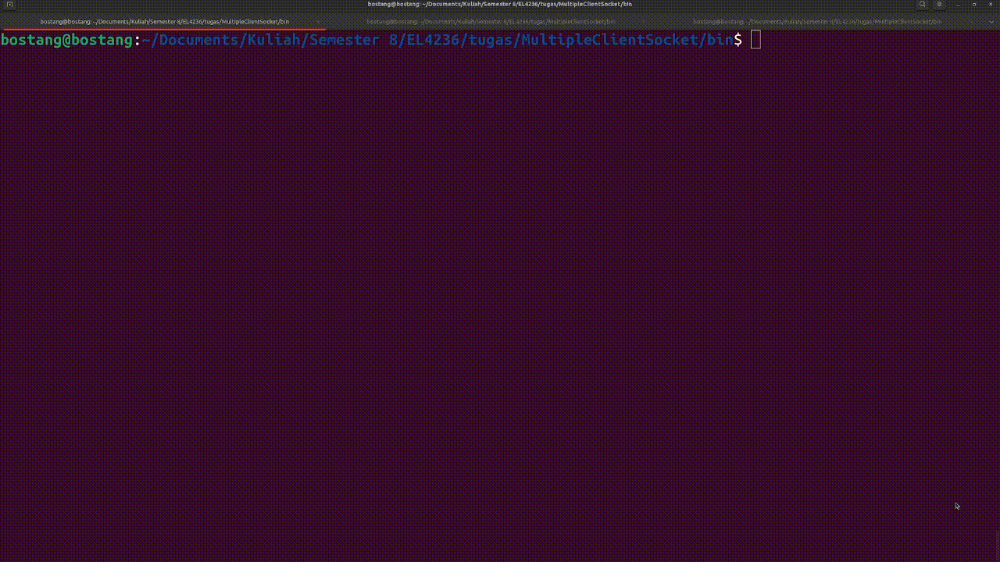

# MultipleClientSocket

Melakukan komunikasi socket antara satu buah server dengan dua buah client menggunakan socket programming. Server diimplementasikan dalam bahasa C. Client diimplementasikan dalam bahasa Python dan C++

Anggota :

1. Bostang Palaguna (13220055)
2. Karma Kunga (13220028)
3. Emmanuella Pramudita Rumanti (13220031)

## Perintah

Buatlah simulasi komunikasi antara dua buah _client_ dengan satu buah _server_ dengan pemrograman socket. Setiap _client_ dan _server_ dibuat dengan bahasa pemrograman yang berbeda.

### **Contoh skenario**
*Sisi Server*
```C
Client1 (Port): nama1
Server : Karma Kunga
Client1 (Port): NIM1
Server : 13220028
Client1 (Port): nama2
Server : Bostang Palaguna
Client1 (Port): NIM2
Server : 13220055
Client2 (Port): nama3
Server : Emmanuella Pramudita Rumanti
Client2 (Port): NIM3
Server : 13220031
Client1 (Port): xyz
Server : Perintah tidak diketahui
Client2 (Port): abc
Server : Perintah tidak diketahui
Client2 Memutus koneksi...
Client1 Memutus koneksi...
```
*Sisi Client1*
```C
[+]Client Socket is created.
[+]Connected to Server.
Client: nama1
Server : Karma Kunga
Client: NIM1
Server : 13220028
Client: nama2
Server : Bostang Palaguna
Client: NIM2
Server : 13220055
Client: xyz
Server : Perintah tidak diketahui
Client: Selesai
[-]Disconnected from server.
```
*Sisi Client1*

```C
[+]Client Socket is created.
[+]Connected to Server.
Client: nama3
Server : Emmanuella Pramudita Rumanti
Client: NIM3
Server : 13220031
Client: abc
Server : Perintah tidak diketahui
Client: Selesai
[-]Disconnected from server.
```
## Direktori Repositori

folder `bin` berisikan file executable hasil kompilasi (untuk kode yang dibuat dalam bahasa C).
folder `ref` berisikan kumpulan repositori yang dijadikan referensi untuk mengerjakan tugas ini.
folder `lib` berisikan fungsi/variabel yang di-inisiasi dan di-deklarasikan di file terpisah.
folder `old` berisikan implementasi-implementasi versi sebelumnya (_buggy_).

## Penjelasan
Serupa dengan server yang meng-_handle_ satu buah client, proses setup server dilakukan dengan potongan kode berikut:
```C
int sockfd, ret;
struct sockaddr_in serverAddr;

int newSocket;
struct sockaddr_in newAddr;

socklen_t addr_size;

char buffer[1024];
pid_t childpid;

sockfd = socket(AF_INET, SOCK_STREAM, 0);
if(sockfd < 0)
{
    printf("[-]Error in connection.\n");
    exit(1);
}
printf("[+]Server Socket is created.\n");

memset(&serverAddr, '\0', sizeof(serverAddr));
serverAddr.sin_family = AF_INET;
serverAddr.sin_port = htons(PORT);
serverAddr.sin_addr.s_addr = inet_addr("127.0.0.1");

ret = bind(sockfd, (struct sockaddr*)&serverAddr, sizeof(serverAddr));
if(ret < 0)
{
    printf("[-]Error in binding.\n");
    exit(1);
}
printf("[+]Bind to port %d\n", PORT);

if(listen(sockfd, 10) == 0)
{
    printf("[+]Listening....\n");
}else
{
    printf("[-]Error in binding.\n");
}
```
Apabila ada _client_ baru yang masuk, maka akan di-_handle_ dengan baris kode berikut:
```C
newSocket = accept(sockfd, (struct sockaddr*)&newAddr, &addr_size);
if(newSocket < 0)
{
    exit(1);
}
flag_kirim = 1;
printf("Connection accepted from %s:%d\n", inet_ntoa(newAddr.sin_addr), ntohs(newAddr.sin_port));

PORT_CLIENT[nClient] = ntohs(newAddr.sin_port);
printf("Assigning client%d to port %d\n",nClient+1,ntohs(newAddr.sin_port));
nClient++;

if (nClient > 40)
{
    printf("Maximum number of clients reached. Connection from %s:%d rejected.\n", inet_ntoa(newAddr.sin_addr), ntohs(newAddr.sin_port));
    close(newSocket);
    continue;
}
```
Apabila ada client yang mengirim pesan, maka akan dilakukan _port_ scanning untuk mengetahui client mana yang mengirimkan pesan lalu akan dibalas dengan baris kode:
```C
recv(newSocket, buffer, 1024, 0);
// apabila ada client yang ingin disconnect
if (strcmp(buffer,"selesai") == 0)
{
    flag_kirim = 0;
    // memeriksa client nomor berapa yang keluar
    for (int i = 0;i<40;i++)
    {
        if (ntohs(newAddr.sin_port) == PORT_CLIENT[i])
        {
            printf("Client%d Memutus koneksi...\n",i+1);
        }
    }
}
else
{
    // memeriksa client nomor berapa yang mengirim pesan
    for (int i = 0;i<40;i++)
    {
        if (ntohs(newAddr.sin_port) == PORT_CLIENT[i])
        {
            printf("Client%d (%s:%d): %s\n",i+1, inet_ntoa(newAddr.sin_addr), ntohs(newAddr.sin_port), buffer);
        }

    }
    response(buffer, buffer); // Menghasilkan respons berdasarkan input dari client
    send(newSocket, buffer, strlen(buffer), 0); // Mengirim respons ke client
    printf("Server: %s\n",buffer);
}
bzero(buffer, sizeof(buffer));
```
Fungsi response akan mengisi ulang `buffer` untuk dikirimkan ke client berdasarkan kondisi `buffer` sekarang (apa yang diterima dari client)
```C
void response(char*buff, char* input)
{
    if (strcmp(input,"nama1") == 0)
    {
        strcpy(buff,nama_developer1);
    }
    else if (...)
    {
      ... 
    }
    ...
    else
    {
      ...
    }
```
Dari sisi client, akan menerima input `scanf`
```C
// menerima pesan dari client
printf("Client: ");
scanf("%s", &buffer[0]);
send(clientSocket, buffer, strlen(buffer), 0);

// jika client ingin dis-connect dari server
if(strcmp(buffer, "selesai") == 0)
{
  close(clientSocket);
  printf("[-]Disconnected from server.\n");
  exit(1);
}

bzero(buffer, sizeof(buffer));

if(recv(clientSocket, buffer, 1024, 0) < 0){
  printf("[-]Error in receiving data.\n");
}else{
  printf("Server: %s\n", buffer);
}
```

## Demonstrasi

Berikut adalah demonstrasi dari komunikasi  antara server (C) dengan dua buah client yang dibuat dalma bahasa python. Namun untuk implementasi client dalam bahasa python dan C++ memiliki gambaran demo yang kurang lebih sama.


